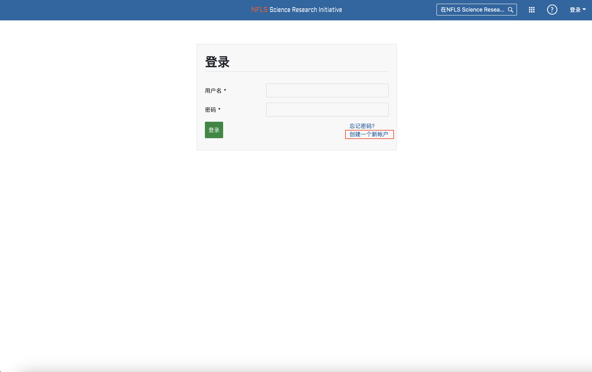
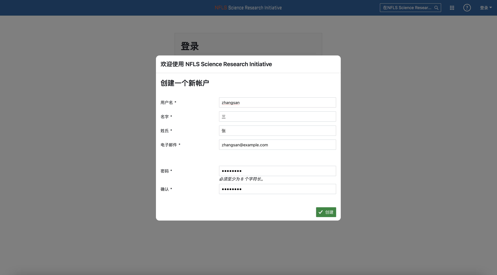
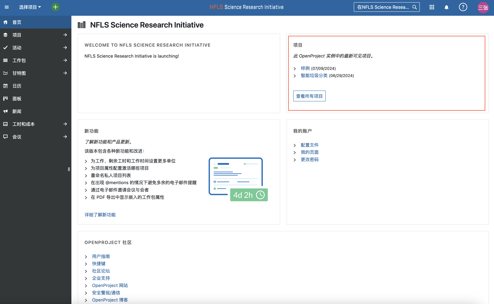
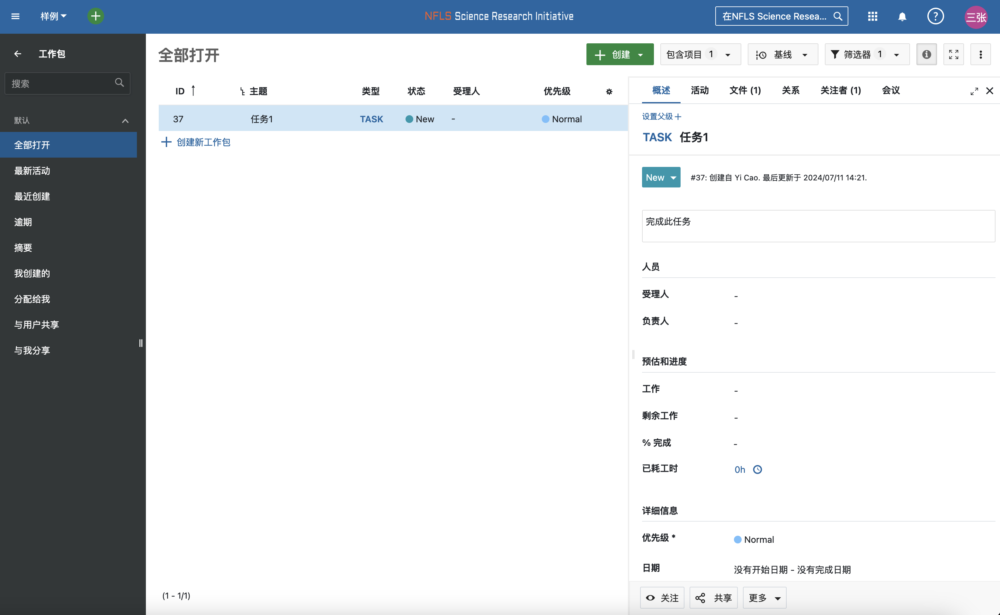
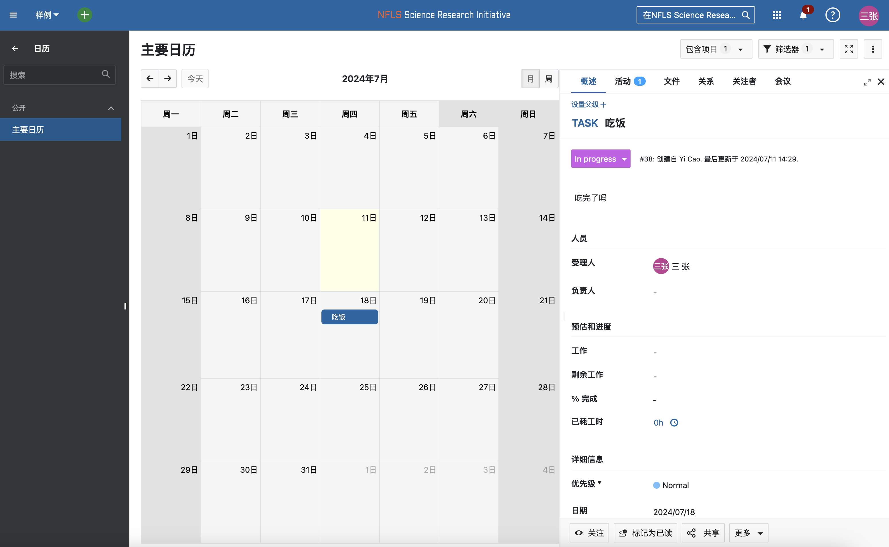

# 用户注册

### 访问SRI登录页面[https://sri.nfls.fun/login](https://sri.nfls.fun/login)

### 点击`创建一个新帐户`并填写表单

### 成功提交后等待管理员批准，在收到管理员确认消息后方可登陆

# 项目参与

### 在登录后主页会显示所有公开的项目

   

> 若选择参与某个项目，请通过项目公布的联系信息与导师联系。如获批准，请等待项目导师邀请加入此项目。

### 在被项目邀请进项目后可以在侧边栏查看详情，如被分配的工作。

   

### 在项目wiki页可以查看项目相关内容。

   

### 在项目日历页可以查看项目会议/讨论/任务提交等日程要求。

   

<!-- 1. x 账号注册stub
1. 项目管理详细
2. 普通用户查看项目-->
