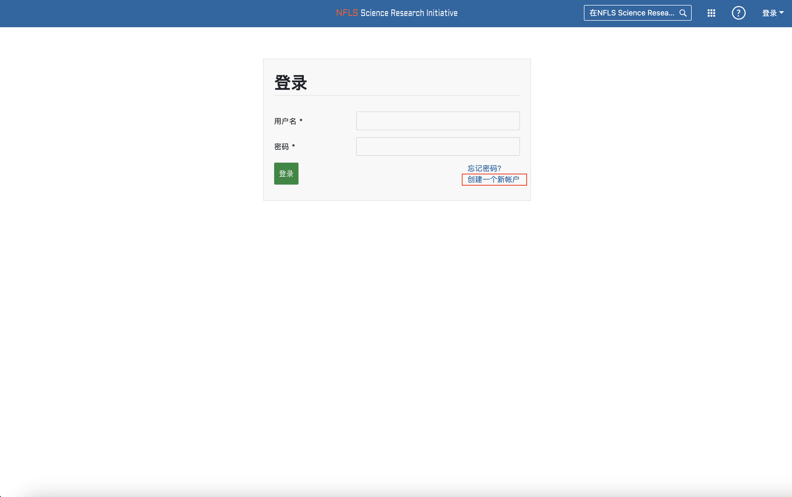
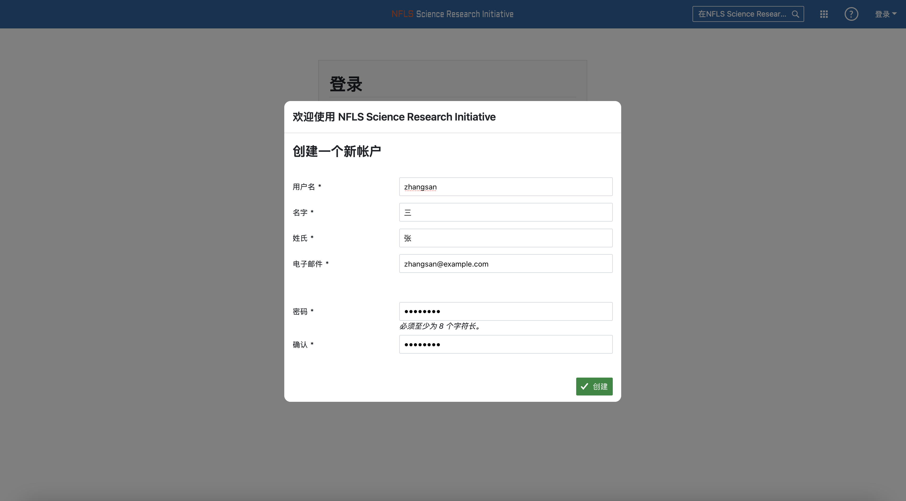
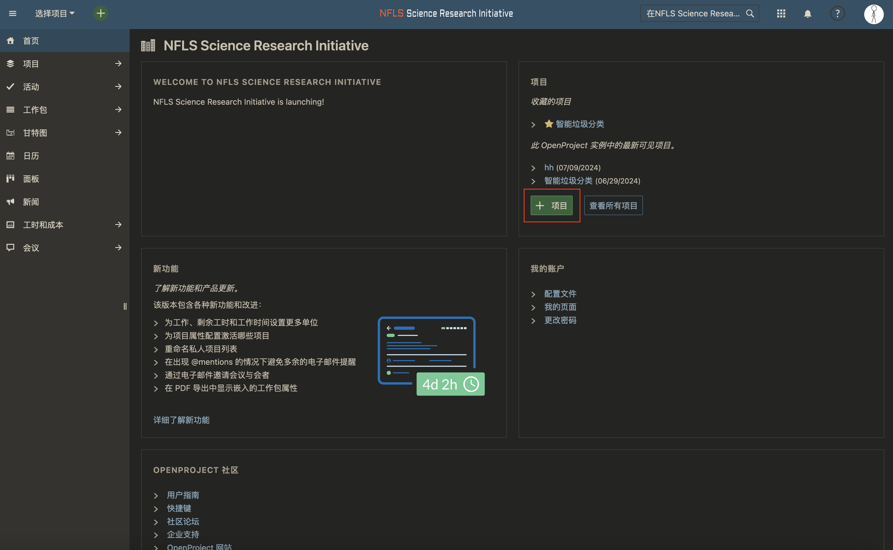
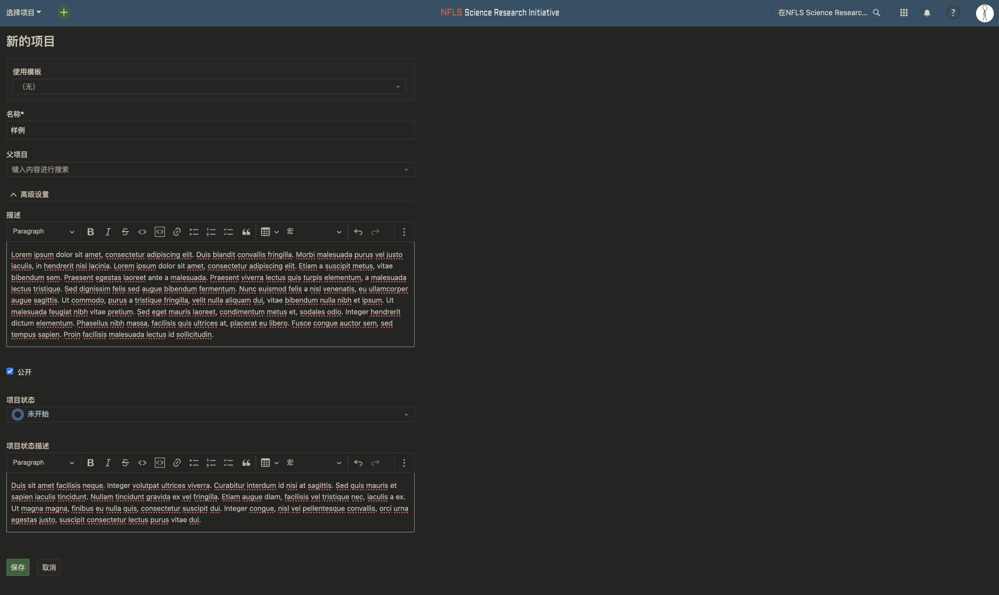
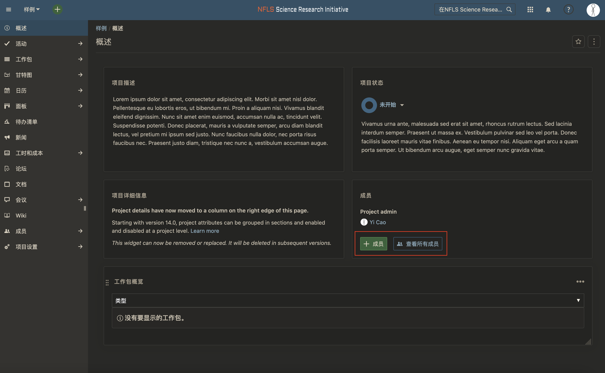
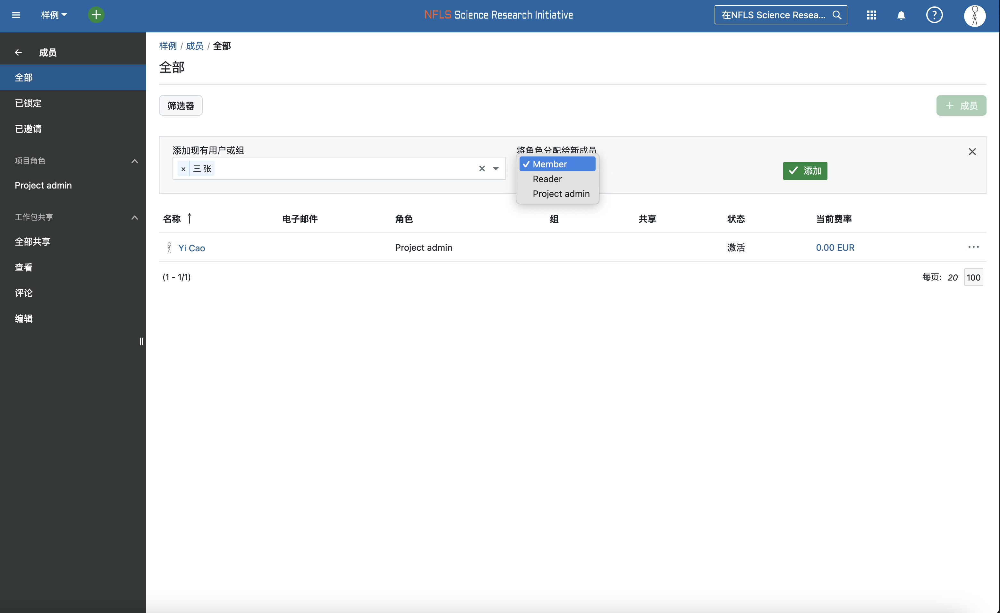
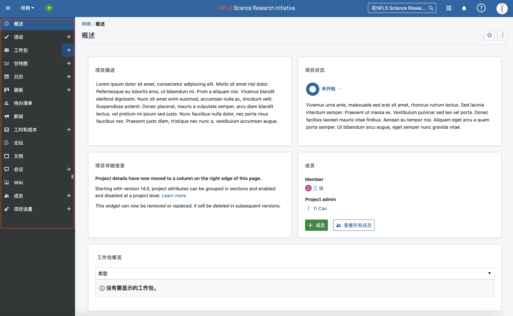
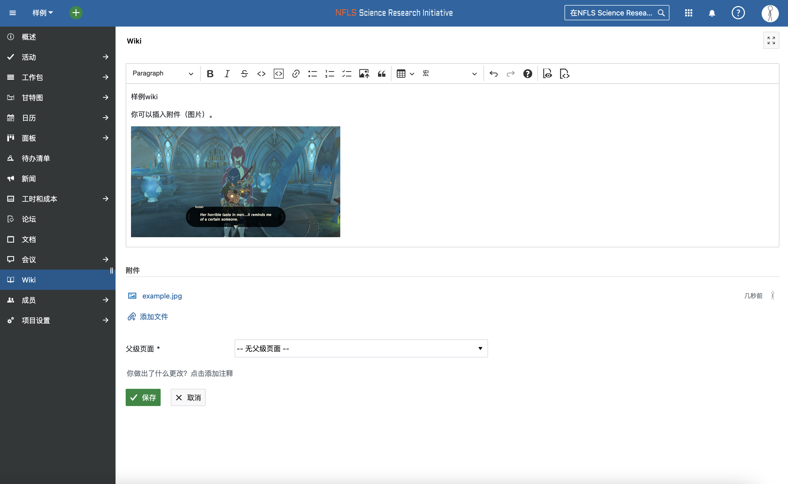
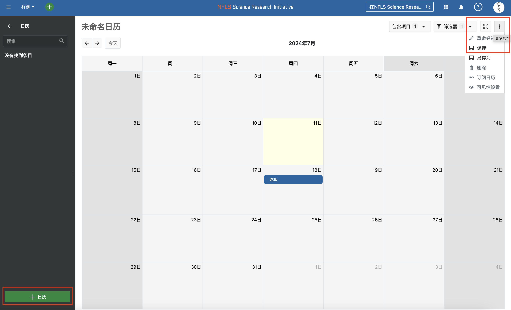
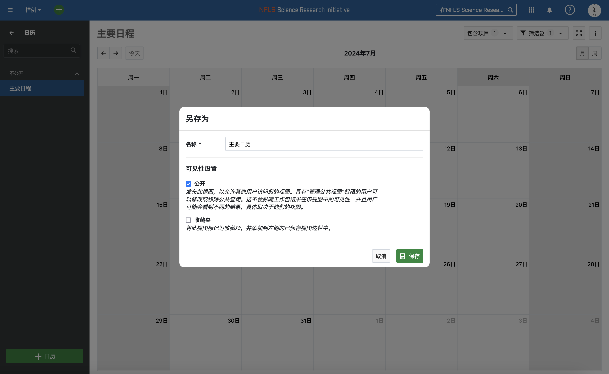

# 用户注册

### 访问SRI登录页面[https://sri.nfls.fun/login](https://sri.nfls.fun/login)

### 点击`创建一个新帐户`并填写表单

> 成功提交后等待管理员批准，在收到管理员确认消息后方可登陆

## 项目管理

### 在被管理员赋予教师身份后可以在主页创建项目

   

### 填写项目说明，模版和父项目不需要选择
   

### 创建后可以在项目页面管理成员
   
   

### 侧边栏有项目有关工具，如日历，工作包和wiki

   

   
   
### 使用日历告知项目成员讨论/会议/任务要求等时间

   

 >第一次使用日历时需要先新建并保存一个

   

<!-- 1. x 账号注册stub
1. 项目管理详细
2. 普通用户查看项目-->
